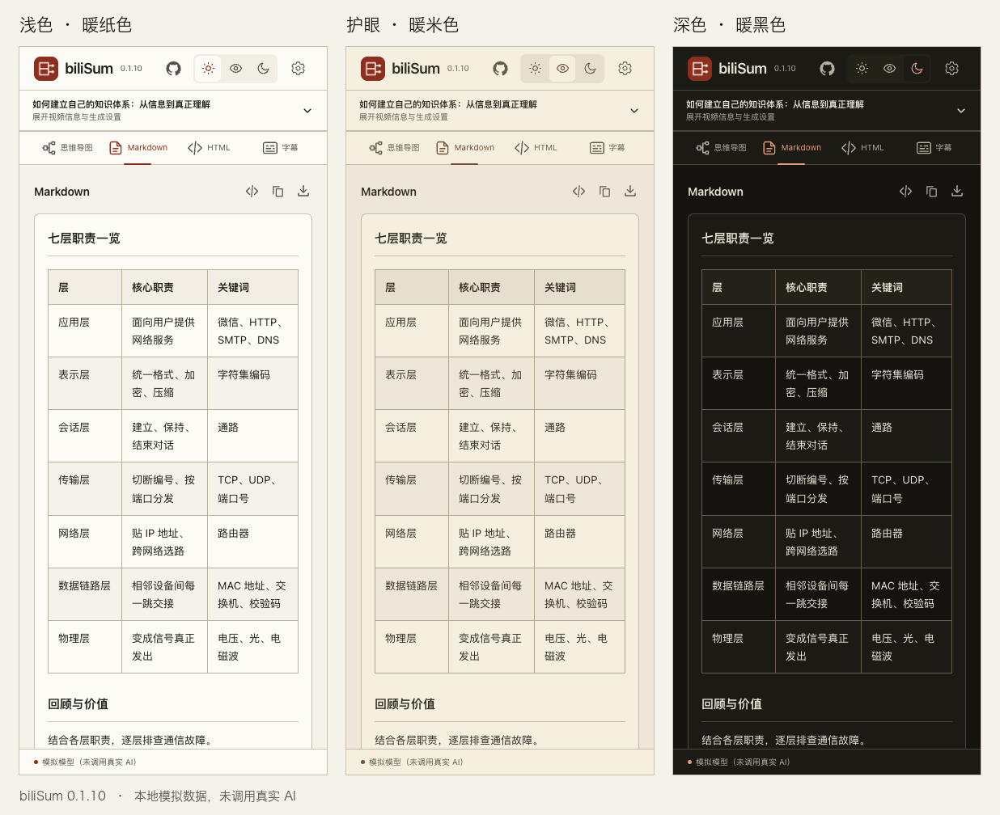
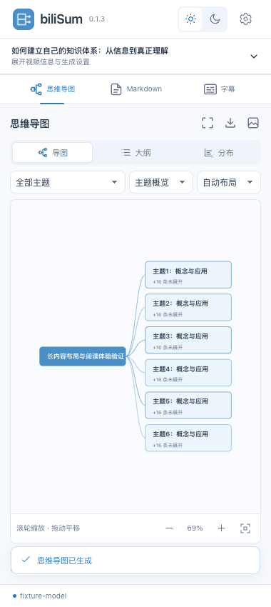
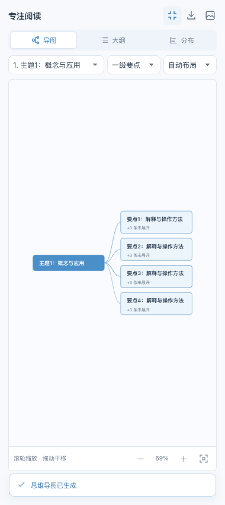
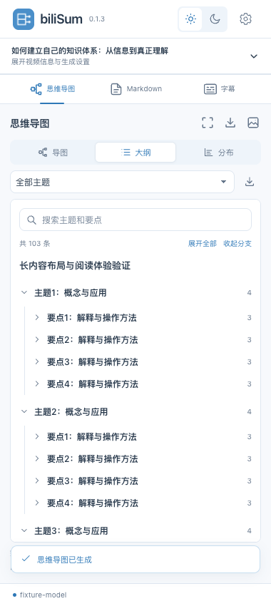
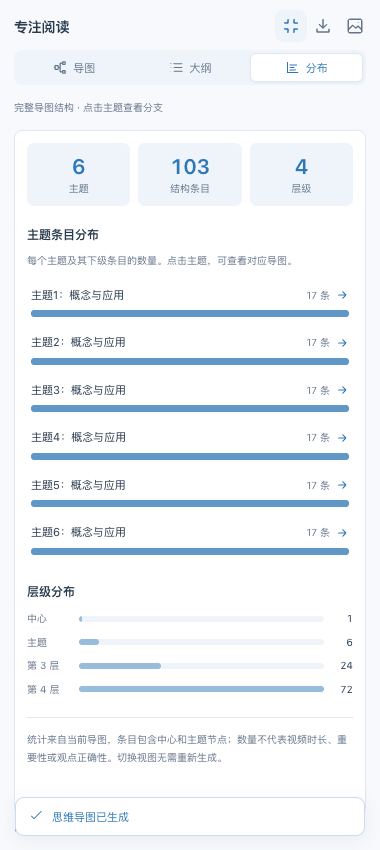
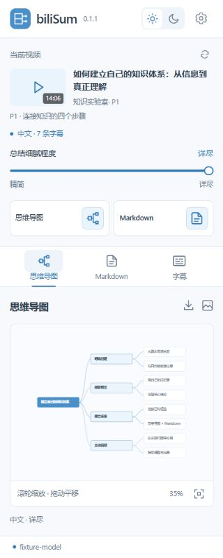
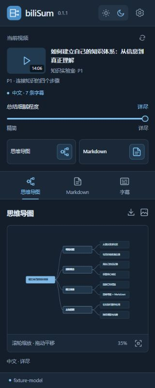
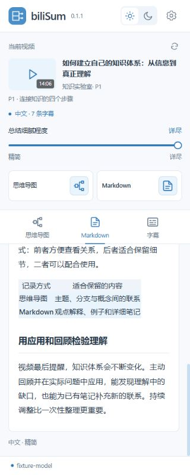
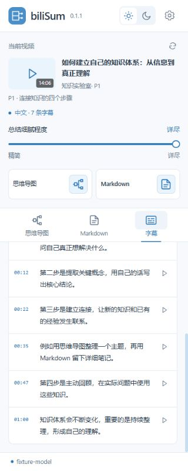

# biliSum

当前版本：**0.1.10**。

一个独立的 Chrome 浏览器扩展：点击工具栏图标，在 B 站视频旁打开原生侧栏，整理思维导图、Markdown / HTML 阅读页和字幕。

## 安装到 Chrome

从 GitHub 下载或克隆的是源码，先在项目目录中构建（Node.js 22 或更新版本）：

```sh
git clone https://github.com/LcodeCoder/biliSum.git
cd biliSum
npm ci
npm run build
```

构建会生成 `dist` 安装目录。已经拿到 ZIP 安装包时，直接解压后继续以下步骤。

1. 打开 Chrome，地址栏输入 `chrome://extensions`。
2. 打开右上角「开发者模式」。
3. 点击「加载已解压的扩展程序」。
4. 选择本项目下的 **dist 文件夹**：

```text
项目目录/dist
```

这个目录里应当直接看到 `manifest.json`。选择项目根目录会报缺少清单。ZIP 安装包请先解压，再选择包含 `manifest.json` 的目录。

5. 在 Chrome 右上角的拼图菜单中找到 **biliSum** 并固定。
6. 打开 B 站视频，点击 biliSum 图标，侧栏会与视频并排显示。

已安装旧版时，在 `chrome://extensions` 找到 biliSum 并点击刷新图标，再关闭并重新打开侧栏。API 配置保留。0.1.3–0.1.9 升级到 0.1.10 可继续读取已完成的结果缓存；0.1.2 及更早版本的结果缓存使用不同的字幕标识，不会自动恢复，请在升级前导出重要结果。

最低 Chrome 版本为 120。侧栏宽度可以拖动边界调整；显示在左边时，可在 Chrome 的侧面板设置中选右侧。

## HTML 阅读页

HTML 和思维导图、Markdown 一样，是独立的 AI 生成类型。获取字幕后点击生成区的 **HTML** 图标，或进入下方 HTML 页面点击「用 AI 生成阅读页」，模型直接分析当前视频字幕，给出核心结论、内容章节、适合的对比表格以及可选主题结构，再由 `answer-me-with-html` 技能的本地适配版排版。无需先生成 Markdown 或思维导图。

支持卡片概览 / 长文阅读、简洁 / 纸张 / 蓝图三种排版样式和专注阅读，默认使用纸张样式。页面跟随扩展的浅色、护眼或深色外观；三种样式保留排版差异并共用当前色板。只有生成和重新生成请求 AI；切换样式、外观、版式、查看缓存及下载均在本地完成。长字幕沿用分段笔记、队列和冷却策略，最终生成按服务商规则计费。

点击下载图标保存单个 `.html` 文件，用浏览器直接打开即可阅读，无需联网或安装扩展。生成失败、返回格式错误或取消时保留上次完整阅读页；不把未完成的 JSON 当作阅读页导出。已完成的 HTML 内容独立缓存，切换视频或字幕来源会清除旧结果。主题条目分布只按本页结构中的真实节点数计算，不代表视频时长或重要性。

导出文件不含脚本、远程资源或 API 配置；原视频和正文中的 HTTP(S) 链接仅在手动点击时打开。阅读页保留分析内容和视频信息，分享前可自行检查其中的内容。

## 配色与护眼模式

右上角太阳、眼睛、月亮三个图标分别切换浅色、护眼、深色外观，选择会保存在本地。浅色采用米白背景、暖灰边框、深棕文字与少量赭红强调；护眼模式降低背景亮度，使用暖米色与柔和棕色；深色使用暖黑背景与浅米色文字。

界面控件、下拉框、表格、Markdown 预览、字幕、导图 / 大纲 / 分布和 HTML 阅读页共用一套色板。切换时保留导图的展开状态和浏览位置，已有结果立即更新样式，不需要重新请求 AI。SVG、PNG 和离线 HTML 跟随下载时的外观；`.md` 是纯文本，配色由打开它的阅读器决定。

## 第一次使用

点击侧栏右上角的齿轮图标，填写：

- **API 地址**：OpenAI 兼容的基础地址（例如 `https://your-api.example/v1`），或完整 `/chat/completions` 地址。
- **API Key**：自己的服务密钥。
- **模型名称**：服务商提供的模型 ID。

点击插头图标测试连接，点击保存图标应用。首次保存或测试时，Chrome 会询问是否允许访问你填写的 API 域名。修改地址后需要重新保存。测试连接会发送一次简短模型请求，按服务商规则计费。

使用本地 OpenAI 兼容服务时，地址可为 `http://localhost:11434/v1` 或 `http://127.0.0.1:端口/v1`；如果服务不校验密钥，可填写 `local`，并填写已安装模型的准确名称。

## 图标与页面

生成与导出操作使用图标，鼠标悬停显示用途，同时提供键盘焦点与无障碍标签。页面导航和视图切换同时显示图标与文字，错误恢复、取消测试和返回完整总结使用文字按钮。下拉框与输入框共享字体、圆角、边框、箭头和焦点样式，支持浅色、护眼、深色三种外观。

- 上方**分支图标**：生成思维导图。完成后自动收起生成设置，支持**导图 / 大纲 / 分布**三种视图、按主题阅读、层级折叠、专注阅读，以及 **SVG / PNG / Markdown 大纲下载**。
- 上方**文档图标**：生成 Markdown 总结。总结页提供渲染预览、源码切换、复制、**.md 下载**。
- 下方 **HTML 图标**：独立请求 AI，把当前视频字幕整理成阅读页，支持卡片概览 / 长文阅读、简洁 / 纸张 / 蓝图三种排版样式、专注阅读和 **.html 下载**。生成和重新生成按服务商规则计费；样式 / 外观 / 版式切换和下载不新增请求。下载的是预览中的同一份文档，可离线打开。
- 下方**字幕图标**：进入字幕页，支持语言选择、搜索高亮、跳转播放器时间、复制、**TXT / SRT 下载**。
- **上传图标**：导入 SRT、VTT、TXT 或 B 站字幕 JSON（`body: [{ from, to, content }]`）。TXT 没有时间轴，因此只提供 TXT 导出和基于文本的总结。
- **刷新图标**：重新读取当前视频与字幕。
- **方块图标**：停止当前生成。
- **太阳 / 月亮图标**：切换浅色 / 深色外观，自动保存选择。
- **齿轮图标**：API 设置。
- **GitHub 图标**：打开 [biliSum 仓库](https://github.com/LcodeCoder/biliSum)，欢迎点个 Star。悬停显示「GitHub · 求 Star」，设置页也可访问。

**总结细腻程度**：上方滑动条提供精简、简要、标准、细致、详尽五档，同时控制下一次 Markdown、思维导图和 HTML 阅读页生成。高档位保留更多论证、例子和细节，低档位聚焦主线；短视频按实际内容整理。修改滑动条后，重新点击相应生成图标即可应用。已生成结果继续显示其生成时的档位。

Markdown 总结以连贯段落为主；比较、步骤、数据等适合表格的内容会按需加入少量表格。表格铺满文档宽度，字号与正文一致，使用加粗表头、交替行底色和清晰行列分隔；宽表在自己的区域内横向滚动，聚焦表格后也可用左右方向键移动。升级后已有总结会直接使用新样式，无需重新生成。思维导图点击父节点可展开下一层，再次点击收起；也可聚焦父节点后按回车或空格操作。以鼠标所在位置为缩放中心；方向键移动，加减键缩放，`Home` 或 `0` 恢复适应画布。切换外观时保留当前导图浏览位置，导出的 SVG / PNG 跟随下载时的当前外观，始终保留完整导图。

切换视频、分 P 或字幕语言时会中止旧任务并更新内容。切换语言或刷新失败时保留原字幕与已生成结果，显示失败原因并允许重试。

生成失败或主动停止后，已收到的 Markdown 会保留为**未完成草稿**，可复制或下载，文件中也会注明内容不完整；有上次完整总结时可切回查看。草稿仅在当前侧栏会话中保留，不写入完整结果缓存，关闭侧栏、切换视频或更换字幕前请先下载。重试由用户点击触发，会重新发起模型请求，可能产生新的费用。

短字幕只请求一次最终结果。长字幕先逐段生成笔记，必要时多轮合并，再请求最终结果；总结和导图共用这一步的已完成笔记。生成前显示分段数量与多次请求提示，进度栏显示当前阶段。最多缓存最近 12 个视频的完整结果，采用约 6 MB 的 JSON 预算；空间不足时优先清理较早结果。缓存失败不影响查看与下载。多个侧栏保存时串行合并，避免互相覆盖。

## 导图阅读与图表

默认先展示一级主题，选择一个主题后展示它的要点；可切到全部层级。窄侧栏默认向右布局，宽屏自动使用双向紧凑布局，也可手动选择。设置区可折叠，专注阅读会腾出上方信息区域，按 `Esc` 返回。100% 按钮可按原始大小阅读；缩得太小时提示选择主题或使用大纲。

生产构建实测：在 380 × 850px 侧栏中，普通模式画布高约 438px，专注模式约 617px。层级折叠和主题选择减少同时显示的节点，设置折叠与专注模式扩大阅读区域。

- **导图**：查看主题关系，支持滚轮缩放、拖动平移、缩放按钮和键盘操作。
- **大纲**：按文字阅读所有条目，支持安全搜索、折叠、展开全部及完整 Markdown 大纲下载。
- **分布**：主题条目数量横条图、层级数量横条图及主题 / 条目 / 层级统计卡片。点击主题可跳到对应分支。统计只反映生成导图的结构，不代表时长或重要性。

三种视图切换保留阅读位置、搜索和折叠状态，不新增模型请求。SVG、PNG 和 Markdown 大纲始终导出完整导图，包含未展开及未选中的主题。

## AI 调用、费用与失败续读

总结、导图和连接测试使用同一个请求队列。同一 API 源一次处理一个请求，最小请求起始间隔为 3 秒，多个侧栏窗口共享队列与冷却时间；其他 API 源独立处理。队列等待不占用模型响应超时，排队超过 90 秒会给出重试提示；生成请求等待响应最多 180 秒，响应后连续 90 秒无数据会停止等待，整次请求最多 10 分钟，持续到达的思考或心跳数据可延续接收但不会突破总时限。连接测试仍为 30 秒。排队或控制频率时可停止，已取消的请求不会补发。

收到 HTTP 429 时遵循 `Retry-After`，缺失时冷却 30 秒；HTTP 503 带此头时也执行冷却。剩余冷却超过 30 秒会直接显示何时重试，较短等待显示倒计时。没有自动付费重试，队列存储故障时在发送前报错。

长字幕已成功的片段和合并笔记只缓存在当前侧栏内存中，闲置 30 分钟过期，最多 4 个输入、约 200 万字符；更换视频、CID、字幕来源、API 账户、模型或细腻程度会隔离笔记。同一配置下，失败重试会复用已完成片段；仅最终生成失败时可直接重发最终请求。生成总结后再生成导图同样可复用笔记，但每次最终生成仍会产生新请求。关闭侧栏、过期或缓存被淘汰后，会重新读取字幕；中断的半个片段不缓存。

Markdown、分段笔记、合并笔记和导图统一请求流式响应，同时兼容服务直接返回 JSON。Markdown 正文保留流式预览；笔记与导图只在内存中积累，结束标记与结构校验通过后才用于后续整理或替换图表。思考内容只更新阶段提示，不进入正文或导图，也不存入缓存。流式事件必须以空行封口，连接结束不会被当作完成标记。

进度提示区分等待响应、模型思考、接收正文和校验导图；不按每个心跳或思考片段重复更新正文。HTTP 408 / 504 / 524 明确提示未收到完整结果及可能已计费，不自动切换到非流式重发。错误页立即停止读取，可选 JSON 错误详情最多读取 5 秒。流式请求能改善脚本的接收路径，但不能保证服务转发数据或消除网关超时。

## 字幕获取

参考原项目 bilibili-copilot 的流程：

1. 从当前标签页 URL 识别 BV / AV 与分 P。
2. 调用 B 站 view 接口，选择当前分 P 的 CID。页面初始数据可作为经过视频标识校验的备用信息源。
3. 读取 player 接口的字幕列表，优先选择中文；对接口失败或空列表尝试备用 player 接口。
4. 下载对应字幕 JSON，并验证时间轴内容。

扩展沿用浏览器的 B 站登录状态。部分视频只有登录后返回字幕；没有可用字幕时可导入已有字幕文件。这一版本不包含音频转写。番剧、直播和短链接页面请先跳转到标准 `www.bilibili.com/video/...` 视频页。

## 数据与权限

完整的数据处理、存储、第三方传输与删除说明见 [隐私政策](PRIVACY.md)。

API Key 以普通字符串保存在当前浏览器配置的本地扩展存储中（不是加密保险库），仅向你配置的 AI 服务发送以完成鉴权，不跨设备同步。生成时，当前视频信息及字幕直接发送到你配置的模型服务。模型输出是整理结果，建议结合视频核对。

固定权限：本地存储、原生侧栏、B 站视频与字幕域名、读取页面信息和定位播放器。自定义 AI 域名在保存或测试配置时单独申请。源码不包含真实 API Key，不加载远程脚本。模型预览限制为文本排版、表格和安全链接；不允许输出中的脚本、图片、框架或链接追踪自动发起请求。API 请求不携带 B 站 Cookie，并拒绝重定向；字幕下载同样拒绝重定向并省略 Cookie，B 站信息接口仍使用登录状态。

本地保存不能防护已控制浏览器配置或操作系统的其他程序。所选模型服务仍能读取提交的字幕与元数据，需自行判断服务商可信度。停止请求可以终止本地等待和后续请求，但无法撤销服务端已处理的请求或保证不计费。

## 开发

需要 Node.js 22 或更新版本。

```powershell
npm ci
npm run check
npm run build
npm test
npm run test:ui
npm run zip
```

- `npm run dev`：WXT 开发模式，输出 `.output/chrome-mv3-dev`。
- `npm run build`：生产构建并复制到易于选择的 `dist` 安装目录。
- `npm run zip`：生成根目录的 `biliSum-版本号-chrome.zip`。
- `npm run preview`：在 `http://127.0.0.1:3003` 使用模拟浏览器 API、模拟视频字幕和模拟模型响应预览编译后的界面。需先构建；不会调用真实服务。测试脚本不打包到扩展中。
- `npm run test:ui`：构建生产包后使用 Playwright 在独立浏览器会话中验证异常恢复，不读取个人浏览器数据，不调用真实 B 站或付费模型。优先使用已安装的 Playwright Chromium，否则使用本机 Chrome；无浏览器时先执行 `npx playwright install chromium`。可用 `BILISUM_CHROME_PATH` 指定浏览器可执行文件。
- `npm run format`：格式化源码。

跨 Windows/macOS 复制项目时不要复用 `node_modules`，请用 `npm ci` 重新安装当前平台依赖。

主要目录：`entrypoints/sidepanel` 侧栏界面、`entrypoints/background.ts` 侧栏入口、`src/lib` 视频/字幕/AI/导出逻辑、`src/components` 图标与页面组件、`tests` 回归测试。

原项目、Primer Octicons GitHub 图标及 `answer-me-with-html` 渲染器的 MIT 版权说明保存在 `THIRD_PARTY_NOTICES.md`，随安装包一起提供。

## 0.1.10 暖色统一与护眼模式

三套色板集中维护，界面、图表和离线文件采用相同颜色。护眼模式独立保存，同时兼容旧版跟随系统的设置；280px 窄侧栏也能完整显示三种外观按钮。HTML 默认纸张样式，三种排版样式都跟随当前外观，包含正文、表格、提示、目录、选中文字和键盘焦点。

以下预览使用本地模拟字幕和模型响应，未调用真实 AI：



0.1.10 验证：`npm run check` **0 错误、0 警告**；`npm test` **99 项**通过；`npm run test:ui` **42 项**通过；`npm audit` 本次报告 **0 个已知依赖漏洞**。覆盖三种外观的实际 SVG / PNG / HTML 下载、护眼偏好刷新恢复、280 / 720px 布局、已有结果本地换色，以及 HTML 页尾和异常恢复回归。安装包、`dist` 与生产构建逐文件一致，扩展权限保持一致。详细记录见 [健壮性与安全复查记录](docs/robustness-review.md)。

## 0.1.9 HTML 页尾显示修复

修复阅读页末尾出现 `lang: zh`、技能排版围栏与 `BILISUM_HTML_*_SLOT` 的问题。原因是本地排版器保存的隐藏源码在清洗时只移除了标签，源码却变成可见文本；现在在清洗前删除整个隐藏源码节点，预览和下载同步修复。

升级后关闭并重新打开侧栏，已有完整 HTML 内容会从缓存重新排版，无需重新请求 AI。以前下载的文件需要在更新后的扩展中重新下载。模型正文中合法出现的同名文本仍保留，不会按关键字全局删除。

## 0.1.8 HTML 独立生成与离线阅读

HTML 使用当前字幕独立请求 AI，生成结果经结构校验后交给 `answer-me-with-html` 0.5.0 的本地浏览器适配版排版。卡片概览 / 长文阅读、三种主题、专注阅读、重新排版和下载均已接入统一控件；版式切换和本地错误重试不会额外请求 AI。

重新生成失败、返回数据损坏或主动取消时，保留上次完整页面和缓存。预览与下载使用同一份无脚本 HTML；下载后目录锚点可离线跳转，页面不加载远程图片、字体或脚本，也不包含 API 配置。排版占位符限定在指定章节内，模型中的同名文字不会替换正文或原视频入口；预览更新及卸载时释放旧 Blob URL。

以下演示由本地模拟字幕和模拟 AI 响应生成，未调用真实模型：

- [离线阅读页 HTML](docs/html-reading-demo.html)
- [1280 × 800 离线阅读效果](docs/html-reading-demo.png)
- [380px 浅色侧栏](docs/html-panel-preview.png)
- [380px 深色专注阅读](docs/html-panel-dark-preview.png)

0.1.8 验证：`npm run check` **0 错误、0 警告**；`npm test` **97 项**通过；`npm run test:ui` **40 项**通过；`npm audit` **0 个已报告的已知漏洞**。覆盖独立 AI 请求、旧缓存兼容、错误 / 取消保留完整页、占位符碰撞、恶意内容隔离、预览资源释放、本地排版 / 下载重试、离线目录跳转和深浅主题 / 窄侧栏控件。ZIP、`dist` 与生产构建逐文件一致，安装包不含测试模拟数据或源映射。详细边界见 [健壮性与安全复查记录](docs/robustness-review.md)。

## 0.1.7 导图逐层展开与文字边界

点击任意父节点（包括中心主题）即可显示下一层子节点，再次点击收起；继续点击子层的父节点可以逐层深入。收起后重新打开只显示下一层，各分支与同名节点独立。父节点显示展开 / 收起提示，支持 Tab 聚焦、回车和空格操作，聚焦屏幕外的父节点时自动带入画布。拖动超过点击容差、取消触摸都不会触发折叠。

展开时保留当前节点的位置，再按需要平移或缩小，让当前父节点和新子层进入可视区域。切换深浅色或导图 / 大纲 / 分布视图保留展开状态；切换布局保留折叠状态并重新适应画布。主题筛选或显示层级变更会按选定层级重新展示。SVG / PNG / Markdown 大纲仍导出完整原始结果，不受当前折叠状态影响。

节点按实际字体宽度换行，组合 emoji、旗帜和带重音字符不会被拆开；背景高度包含全部标题行、内边距和折叠提示。SVG / PNG 导出使用相同的字体测量与换行规则。

0.1.7 验证：`npm run check` **0 错误、0 警告**；`npm test` **89 项**通过；`npm run test:ui` **31 项**通过。新增检查覆盖逐层展开、同名节点独立、重复折叠、拖动 / 触摸取消、键盘焦点、主题 / 布局 / 层级切换、实际 SVG 文字边界与完整 SVG / PNG 导出，使用本地模拟数据与独立 Chrome 会话。

## 0.1.6 GitHub 入口

顶部工具栏使用本地 SVG GitHub 图标，悬停提示「GitHub · 求 Star」。点击或键盘回车在新标签页打开项目仓库，设置页同样可以访问。入口不请求 GitHub API，也不加载远程图标。窄侧栏保留所有操作按钮，收紧间距并隐藏版本标签。

使用生产构建和本地模拟数据验证深浅主题与 280 / 320 / 335 / 336 / 340 / 360 / 380 / 720px 宽度；按钮无重叠、裁切或页面横向溢出。新标签页导航通过本地拦截确认目标地址及 `window.opener` 隔离：

- [380px 浅色侧栏](docs/github-header-380-light-preview.png)
- [280px 深色侧栏](docs/github-header-280-dark-preview.png)

## 0.1.5 表格预览

七层表格使用本地模拟 API 与生产构建验证；截图不来自真实模型调用：

| 宽度 / 主题  | 效果图                                                     |
| ------------ | ---------------------------------------------------------- |
| 720px / 浅色 | [宽屏表格](docs/markdown-table-720-light-preview.png)      |
| 720px / 深色 | [深色表格](docs/markdown-table-720-dark-preview.png)       |
| 380px / 浅色 | [侧栏表格](docs/markdown-table-380-light-preview.png)      |
| 280px / 深色 | [窄侧栏独立滚动](docs/markdown-table-280-dark-preview.png) |

## 0.1.6 健壮性修复与验证

0.1.6 验证结果：`npm run check` 为 **0 错误、0 警告**；`npm test` 的 **84 项**单元测试通过；`npm run test:ui` 的 **27 项**浏览器模拟测试通过；依赖审计未报告已知漏洞。详细修复、验证边界和风险见 [健壮性与安全复查记录](docs/robustness-review.md)。

测试包括失败保留字幕与结果、草稿下载、视频切换即时取消、异步缓存标识检查、并发队列与冷却、失败续读、权限弹窗等待取消、恶意 HTML / 地址、导图三视图与完整导出，以及 280 / 320 / 380 / 720px 深浅主题下的控件与表格样式、宽表键盘滚动、合并行列和 Markdown 源码 / 下载保留。使用生产构建、本地模拟 API 和独立 Chrome 会话；未调用付费模型或读取个人浏览器配置。本轮另行验证 GitHub 图标在设置页可见、键盘焦点、安全新标签页打开和响应式临界宽度；导航在本地拦截，未请求真实 GitHub 页面。真实 B 站接口、原生授权弹窗与模型服务的兼容性仍需实际环境验证。

## 0.1.3 界面预览

以下截图使用生产构建与模拟的 103 条目导图：









## 历史界面预览与验证

以下截图来自生产构建，使用模拟视频、字幕和模型响应：









验证记录（2026-10-08，0.1.1）：`npm run check` 为 0 错误、0 警告，`npm test` 的 28 项测试全部通过。测试覆盖字幕处理、请求流式读取、细腻程度提示与长字幕预算、思维导图布局与光标锚定缩放等。

浏览器模拟环境已验证 320px 窄侧栏无横向溢出、深浅外观和档位刷新后保留、主题切换保留导图位置、真实滚轮缩放和拖动平移、两种生成请求使用相应档位、段落与表格预览，以及 SVG / PNG / Markdown 文件实际下载。生成后调整档位，旧结果及导出的 Markdown 继续记录原来的档位；验证期间浏览器控制台没有错误或警告。

上一版本还验证了 SRT 下载、字幕搜索与跳转、语言切换、API 报错和生成中切换分 P。ZIP 清单与生产安装目录已核对。以上界面验证使用模拟数据；未调用付费模型服务。实际 B 站视频及模型效果可在本地 Chrome 中使用自己的 API 配置查看。
